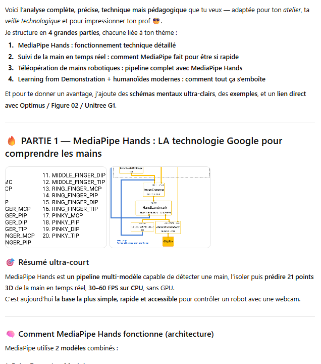
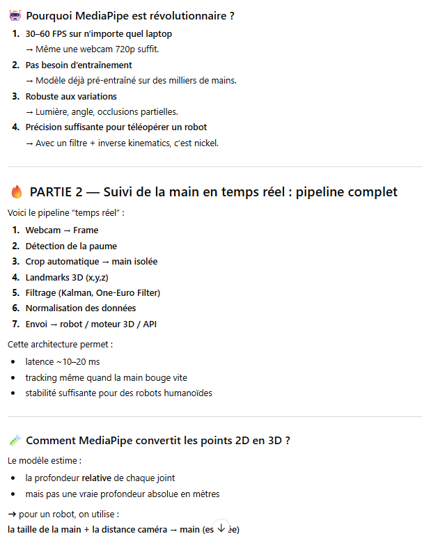
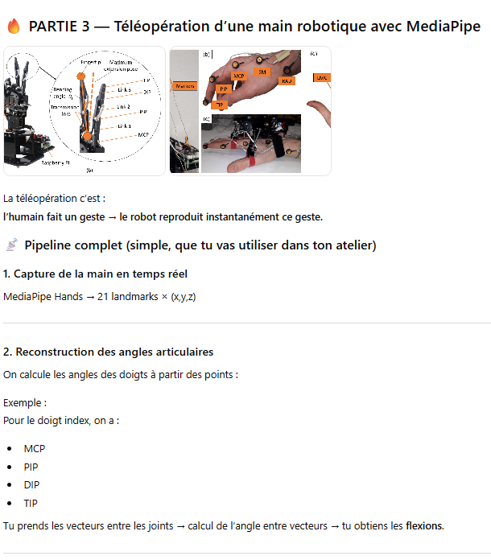
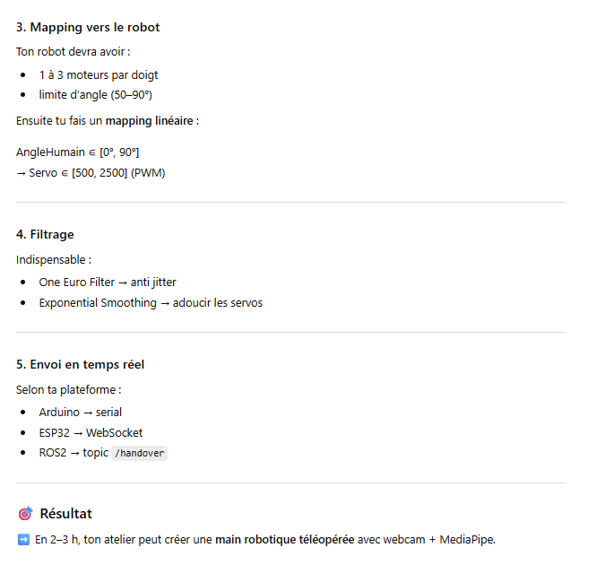
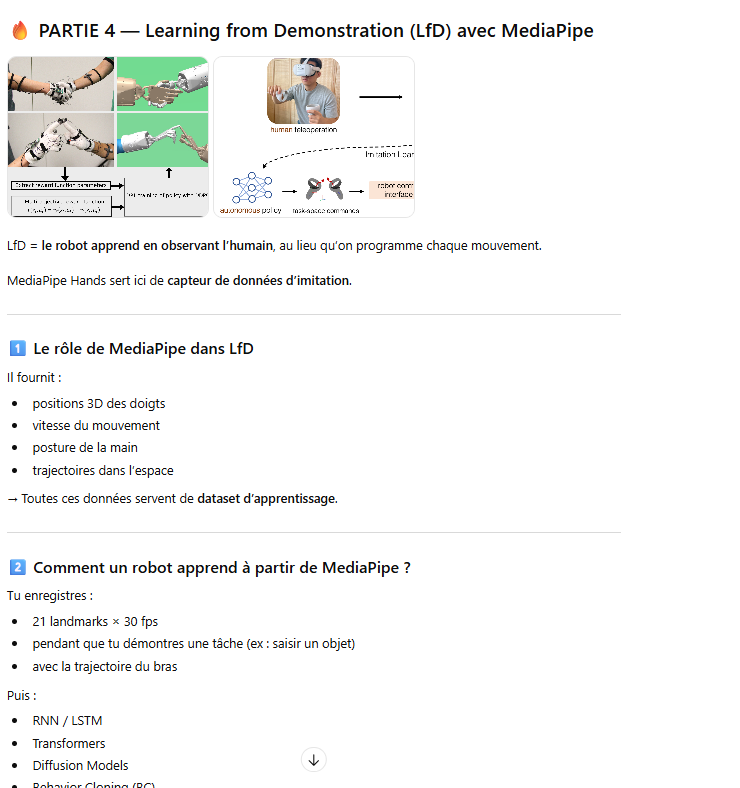
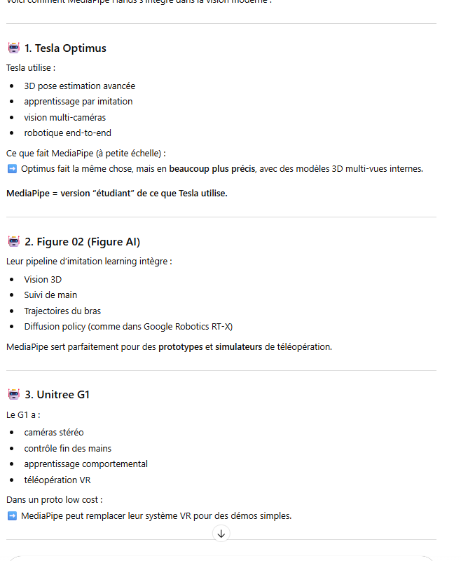

+++
title = "Veille technologique"
weight = 1
+++

## Les actions entreprises pour votre veille technologique.

### Veille technologique 

#### Premier prompt formuler  pour chatgpt 5.1
> Je veux une analyse complète, précise, technique mais pédagogique sur la technologie suivante : MediaPipe Hands (Google) et son rôle dans : le suivi de la main en temps réel la téléopération des mains robotiques l’apprentissage par imitation (Learning from Demonstration) les humanoïdes modernes (Tesla Optimus, Figure 02, Unitree G1, etc.)

▶ Voici la réponse du LLM

> La réponse fournie est très complète. La raison pour laquelle la réponse est complète et qu’elle m’a permis de comprendre l’essentiel de cette technologie, c’est que l’explication est vraiment adaptée directement à l’application que je voulais : la robotique. J’ai compris que le MediaPipe est beaucoup utilisé pour des petits jeux en réalités augmentées, mais moi je voulais vraiment comprendre comment cette technologie peut être utile dans la robotique et la téléopération d’une main robotique. Il m’a même donné des images qui sont disponibles dans d’autres sites, comme des graphiques qui me permettent vraiment de comprendre la conception et comment l’outil fonctionne. Comme question qui suit, je lui ai demandé si cet outil peut être utilisé sur tout le corps et non seulement avec la main. Il m’a répondu que oui, c’est possible. J’ai par la suite demandé quelles sont les limites de cette technologie.

### 1. Article scientifique / technique récent (obligatoire)

**Source 1 : Article récent (2023–2024)**  
MediaPipe Hands: On-Device Real-Time Hand Tracking" – Google Research Blog (2023)  
https://research.google/blog/on-device-real-time-hand-tracking-with-mediapipe/  
Google Research a publié plusieurs mises à jour sur MediaPipe entre 2022 et 2024, notamment concernant les nouvelles versions de la détection des paumes, l’optimisation mobile, et l’intégration avec TensorFlow Lite.

**Pourquoi cette source ?**
- C’est une source essentielle puisque ce sont les créateurs directs de la technologie
- Ce sont eux qui feraient des mises à jour constantes sur leur produit donc ils sont les plus à jour
- Il explique le fonctionnement précis de l’aide de graphique comme le llm

**Utilisation dans mes notes de cours**  
Cette source m’a permis de comprendre le pipeline réel utilisé dans MediaPipe, les 21 points de la main, et les optimisations en temps réel et que c’est la paume qui est détectée et que par la suite les autres points sont trouvés genre. Cela valide techniquement ce que le LLM a expliqué.

________________________________________

### 2. Article d’ingénierie robotique utilisant MediaPipe (2023–2024)

**Source 2 : "Teleoperation of Robotic Hands using MediaPipe Hand Tracking" – ArXiv, 2023**  
https://arxiv.org/html/2307.04577v3  
https://arxiv.org/html/2508.14994v1  
Cet article présente un système complet de téléopération basé sur MediaPipe, avec conversion des points en angles articulaires qui permet de comprendre une façon d’utiliser le mediapipe dans la robotique . Avec des mains humanoides ou avec un robot qui a 4 pieds

**Pourquoi cette source ?**
- Il montre exactement l’usage que je veux faire : contrôler un robot à l’aide du mediapipe.
- L’article discute les limites : jitter, occlusions, perte de tracking, profondeur approximative. Que ce n’est pas la meilleure solution mais s’en est une vraiment accessible

**Utilisation dans mes notes**  
Cette source confirme que MediaPipe est réellement utilisé dans la robotique low-cost et dans des ateliers éducatifs.

________________________________________

### 4. Sources YouTube pertinentes (non commerciales)

**YouTube – Source A : "Nicholas Renotte – Computer Vision Tutorials"**  
https://youtu.be/pG4sUNDOZFg?si=5KtSSB0LvGZdo6Ad  
Il explique parfaitement MediaPipe Hands, comment extraire les landmarks, comment convertir en angles, et comment faire des prototypes robotisés. Très pédagogique, techniquement rigoureux, pas affilié à Google. Il m’a permis a comprendre l’installation de la librairie et à quel point on peut faire plein de choses avec cette librairie.

### 5. Sources réseaux sociaux

**Twitter/X  thread**  
J’ai juste naviguer un peu sur twitter avec le query mediapipe pour voir les avis des gens sur cette technologie comment les gens l’utilisent pour faire différents projets que ça soit téléopériation ou de la réalité augmenté voici quelque threads et vidéo qui m’ont aider à en savoir plus sur cette technologie. 

> Dans ce lien c’est une personne qui a fait un bras de robot qu’il contrôle avec une webcam et de la téléopération.
https://x.com/pham_blnh/status/1975594015014969722?s=20

> Dans ce lien il y a une personne qui a fait une simulation de mixing de dg avec mediapipe en réalité augmenté. Et y’a plein d’autre facon unique

### Conclusion de la veille

Cette veille m’a permis de comprendre que MediaPipe Hands est une brique logicielle idéale pour prototyper de la téléopération de mains robotiques avec du matériel très accessible (webcam + laptop). Même si la librairie a des limites (profondeur relative, occlusions, jitter), elle est suffisante pour un atelier pédagogique et pour collecter des données de démonstration. À plus long terme, je pourrais combiner MediaPipe avec d’autres outils de vision 3D ou des capteurs physiques pour aller vers des systèmes plus robustes, proches de ce qui est utilisé sur des humanoïdes comme Tesla Optimus ou Figure 02.
